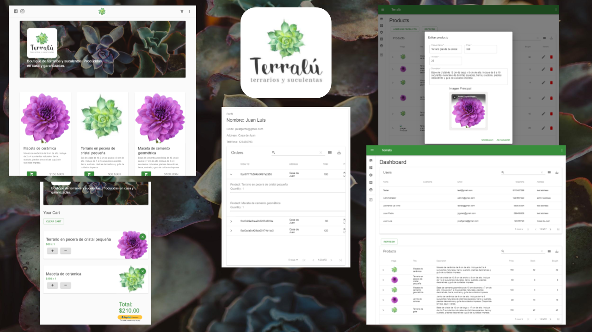

# Terralú


## Run project

```
git clone https://github.com/terralu/website
cd website
npm i
cd client
npm i
cd ..
npm run dev
```

## Credentials

```
Admin:
user: admin@gmail.com
pw: rootroot
```

```
Customer:
user: test@gmail.com
pw: test123
```

### Paypal Sandbox Credentials

```
Customer:
user: terralumx-buyer1@gmail.com
pw: terra2019
```

## Project Config

create a `.env` file at root with the following structure.

```
MONGO_URI=
N_EMAIL=
N_PASSWORD=
```

create a `.env` file at client dir root with the following structure.

```
REACT_APP_PS_TOKEN="PAYPAL_SANDBOX_CODE"
```
